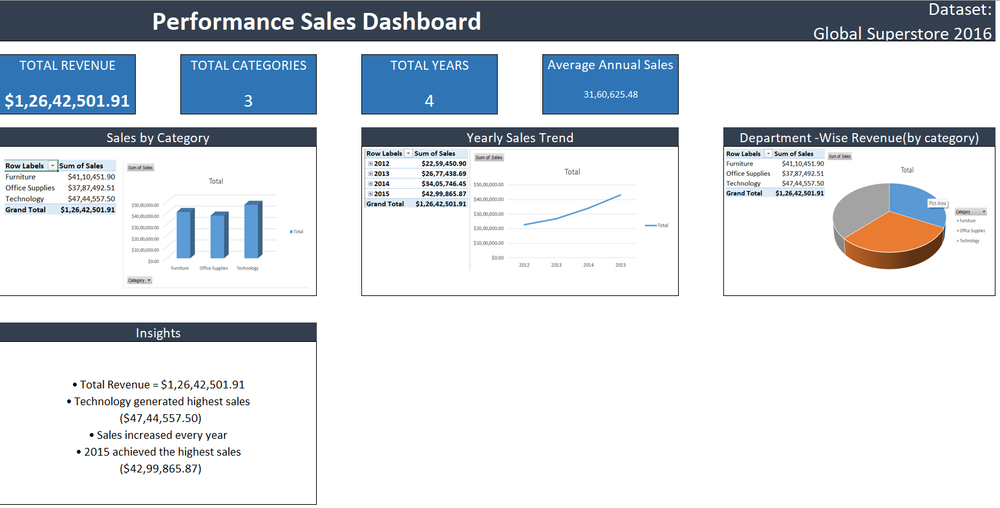

# Global Superstore Sales Dashboard

## Project Overview

This project analyzes the Global Superstore 2016 dataset using Microsoft Excel Pivot Tables and Pivot Charts.

## Objectives

- Calculate Total Revenue
- Analyze Sales by Category
- Identify Yearly Sales Trends
- Examine Department-wise Revenue

## Dataset

Global Superstore 2016 Dataset

Source:
https://github.com/hshariq/Global-Superstore-2016-Power-BI/raw/main/global_superstore_2016.xlsx

## Tools Used

- Microsoft Excel
- Pivot Tables
- Pivot Charts
- Dashboard Design

## Key Findings

### Total Revenue

$1,26,42,501.91

### Sales by Category

- Technology: $47,44,557.50
- Furniture: $41,10,451.90
- Office Supplies: $37,87,492.51

### Yearly Sales Trend

- 2012: $22,59,450.90
- 2013: $26,77,438.69
- 2014: $34,05,746.45
- 2015: $42,99,865.87

Sales increased consistently each year.

## Dashboard Screenshot

## Author

Akanksha Bagiyal
